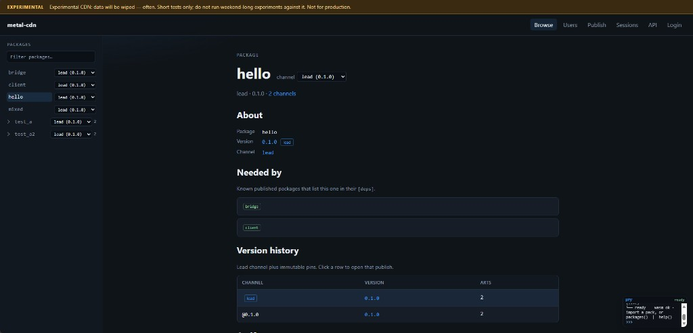
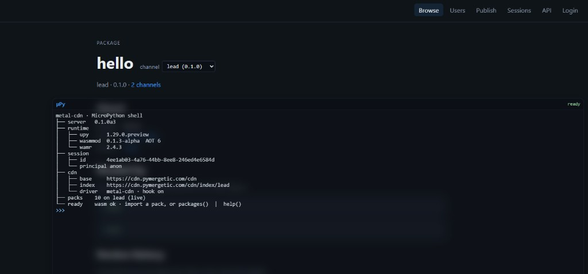
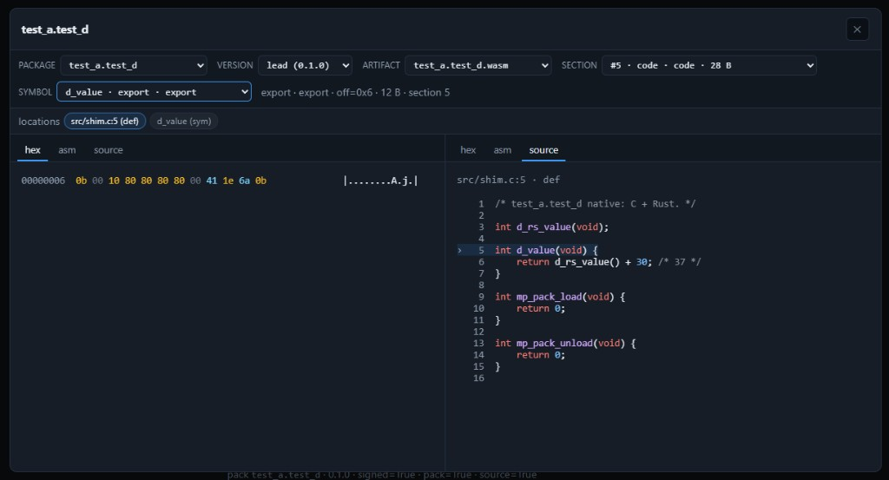
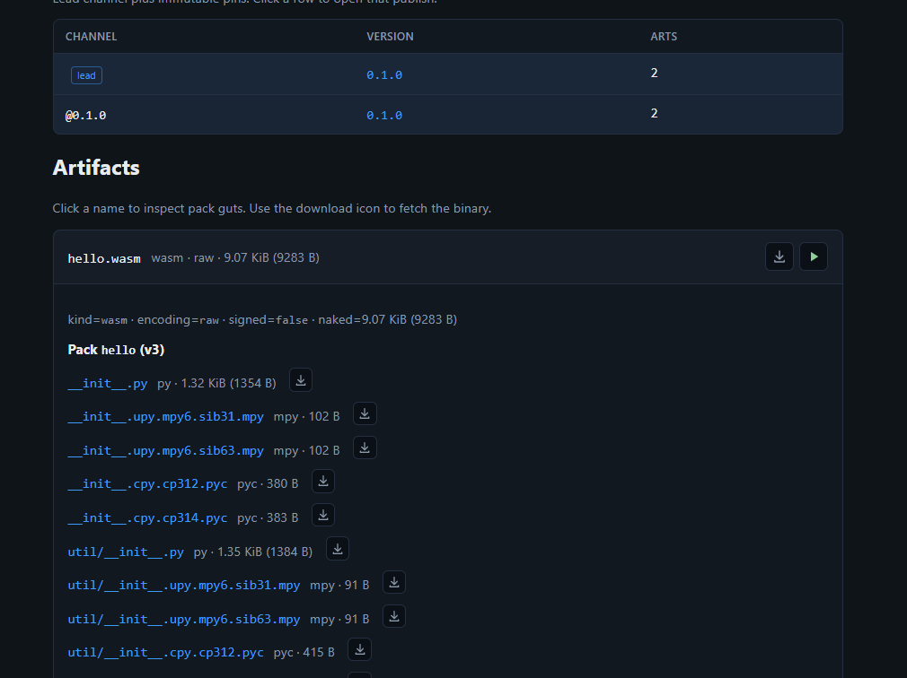
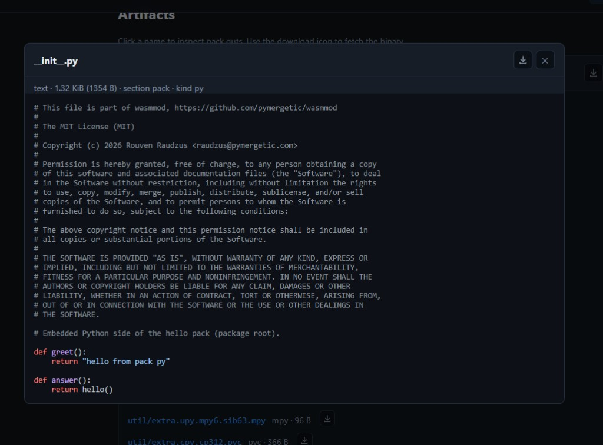
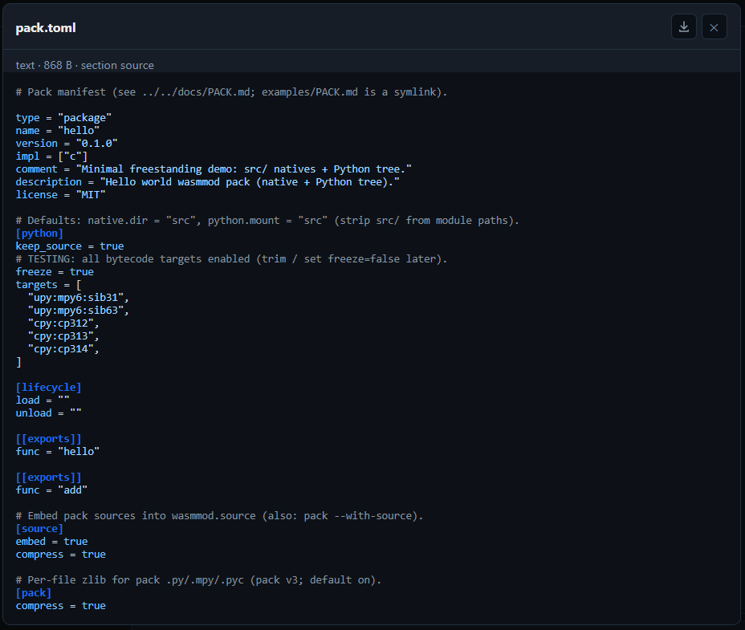
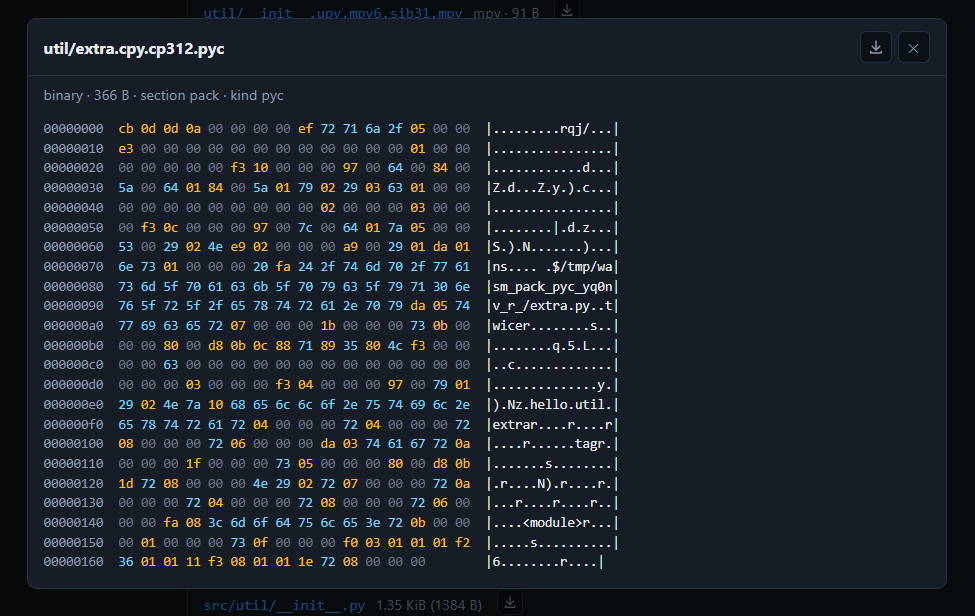
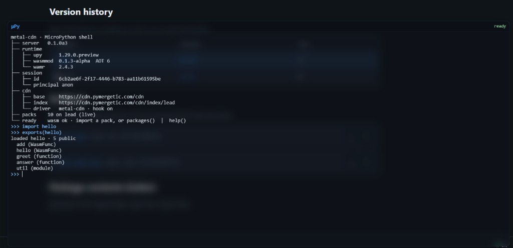
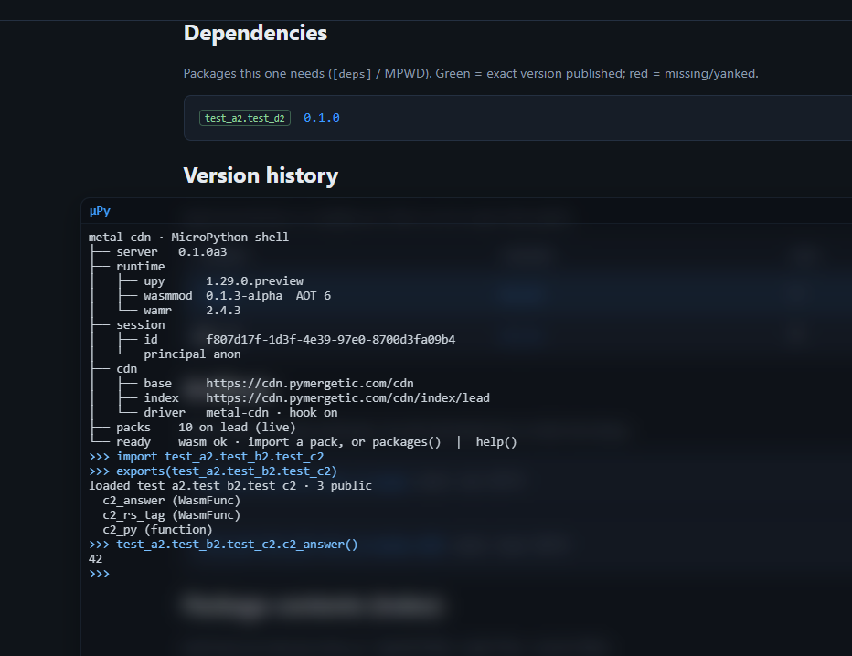
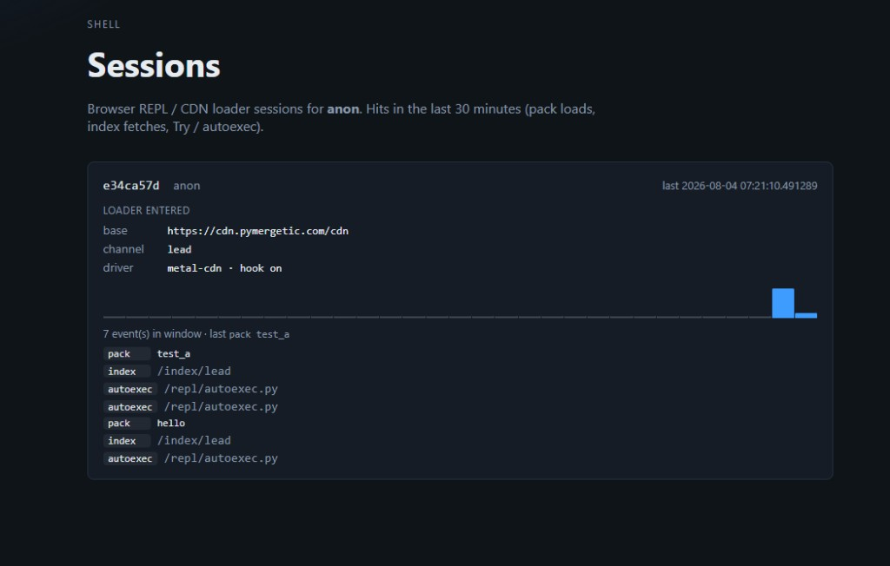

# metal-cdn

PyPI: **`pymergetic-metal-cdn`** · Client: **`pymergetic-metal-cdn-client`**  
Live demo: **[cdn.pymergetic.com/cdn](https://cdn.pymergetic.com/cdn/)** · Pack format: [wasmmod](https://github.com/pymergetic/wasmmod)

Async FastAPI channel for signed wasmmod packs — browse, publish, inspect
(hex / asm / source), and try them in a browser MicroPython shell.

> **Experimental.** Data on the public demo is wiped often. Short tests only — not for production.

| Component | Role | Repo |
|-----------|------|------|
| wasmmod | Runtime + pack tree (`pymergetic-wasmmod`) | [pymergetic/wasmmod](https://github.com/pymergetic/wasmmod) · `main` |
| wasmmod-tools | Host CLI (`pymergetic-wasmmod-tools`) | [pymergetic/wasmmod-tools](https://github.com/pymergetic/wasmmod-tools) · `main` |
| wasmmod-test | External pack/CDN consumer sample | [pymergetic/wasmmod-test](https://github.com/pymergetic/wasmmod-test) · `main` |
| **metal-cdn** | **This repo** — CDN server + client | [pymergetic/metal-cdn](https://github.com/pymergetic/metal-cdn) · `main` |
| metalpython `wasmmod` | Clean upy host + submodule (upstream-shaped) | [metalpython/tree/wasmmod](https://github.com/pymergetic/metalpython/tree/wasmmod) |
| metalpython `master` | Metal product µPy; **base = `wasmmod` tip** | [metalpython/tree/master](https://github.com/pymergetic/metalpython/tree/master) |

<p align="center">
  
</p>

Channel **state** (artifacts + `index.json`) lives in object storage.  
Publisher **identity** (users + ACL) lives in SQL.  
Devices still verify pack signatures with wasmmod — this service does not replace that.

UI styles: `static/site.css` barrels `static/css/*.css` (tokens, layout, catalog, artifacts, inspect, chrome, sessions, repl). Inspect JS: `static/inspect/*.js`.

**Forks / mirrors:** set `METAL_CDN_PUBLIC_ORIGIN`, `METAL_CDN_BASE_PATH`, optional
`METAL_CDN_BRAND_NAME` / `METAL_CDN_BRAND_LOGO_URL`, and `METAL_CDN_CORS_ORIGINS`
so your UI and `wasm.cdn(...)` clients point at *your* host (see [docs/PROXY.md](docs/PROXY.md)).

---

## What you get

| Surface | What it does |
|---------|----------------|
| **Browse** | Package tree, lead / `@version` pins, dependents |
| **Artifacts** | Expand a `.wasm` / `.elf` / `.zlib` / AOT blob → pack + source file list |
| **Inspect** | Dual-pane commander — hex / asm / source, location chips (def / decl / dwarf) |
| **Source viewer** | Quick highlight (py / c / rs / toml / …) or hex for binaries |
| **µPy shell** | In-browser MicroPython + wasmmod: ▶ → `import` + `exports()` |
| **Sessions** | Per-browser loader sessions — autoexec / pack / index hits |
| **Federation** | Peer mounts, grants, upstream publish (MetalFed tickets) |
| **Publish** | Multipart UI + CLI / thin client for CI |

<p align="center">
  
</p>

---

## Inspect a pack

Click an artifact (or the eye on a section / export / embedded file) to open
**Inspect** — package · version · artifact · section · symbol navigation with
dual panes (hex / asm / source). Location chips jump between DWARF hits,
C/Rust `def` / `decl` lines, and Python twins when `wasmmod.source` is embedded.

<p align="center">
  
</p>

Expand the artifact row for the pack/source file tree without opening the commander:

<p align="center">
  
</p>

Quick open (name click) still uses the light source dialog — syntax highlight for
text, hex for binaries:

<p align="center">
  
  &nbsp;
  
</p>

<p align="center">
  
</p>

---

## Install

```sh
pip install pymergetic-metal-cdn
# from this repo (client first — server depends on it):
pip install -e ./client -e ".[dev]" --config-settings editable_mode=compat
```

Thin publish/download wheel (no FastAPI): **`pymergetic-metal-cdn-client`**  
→ `pymergetic.metal.cdn_client` — [docs/CLIENT.md](docs/CLIENT.md) · [client/README.md](client/README.md).

Version comes from git tags via [setuptools-scm](https://github.com/pypa/setuptools-scm) (`metal-cdn --version`).

---

## Quick start

```sh
cd packages/metal-cdn
python3 -m venv .venv && source .venv/bin/activate
pip install -e ./client -e ".[dev]" --config-settings editable_mode=compat
cp .env.example .env
metal-cdn serve --reload
# → http://127.0.0.1:8000/cdn/        UI
# → http://127.0.0.1:8000/cdn/docs    OpenAPI
```

### Docker one-shot

Rebuild browser µPy (if needed), sync REPL assets, `docker build`/`run` with
**auth required**, seed sample packs with a Bearer token:

```sh
./scripts/ensure-secrets.sh   # once → .secrets/cdn.env (gitignored)
./scripts/dev-up.sh
# → http://127.0.0.1:8000/cdn/   (µPy: packages() | import hello)
# login: email from .secrets/cdn.env ; seed token: .secrets/token
```

Flags: `--no-upy`, `--no-seed`, `--seed-only`, `--reseed`.  
Env: `METALPYTHON`, `METAL_CDN_URL`, `METAL_CDN_PORT`, `METAL_CDN_SESSION_SECRET`.  
Details: [docs/CLIENT.md](docs/CLIENT.md#public-test-first-boot-auth-on).

### Public TLS edge

**https://cdn.pymergetic.com/cdn/** — see [docs/PROXY.md](docs/PROXY.md).

```sh
./scripts/ensure-secrets.sh
./scripts/dev-up.sh --no-upy
docker compose --profile proxy up -d nginx
curl -sf https://cdn.pymergetic.com/cdn/health
```

---

## Try packs in the shell

The floating **µPy** panel warms MicroPython in the background. When status is **ready**, hit ▶ on an artifact (or type it yourself):

```python
import hello
exports(hello)      # public names + types (+ docstring line when set)
hello.greet()
```

<p align="center">
  
</p>

```text
loaded hello · 5 public
  add (WasmFunc)
  hello (WasmFunc)
  greet (function)
  answer (function)
  util (module)
```

Dotted trees work too (missing middle packs become namespaces):

```python
import test_a2.test_b2.test_c2
exports(test_a2.test_b2.test_c2)
test_a2.test_b2.test_c2.c2_answer()   # → 42
```

<p align="center">
  
</p>

- `packages()` — live lead catalog (or autoexec snapshot)
- `exports(mod)` — shipped in autoexec (same place as `help()`)
- `GET /repl/autoexec.py` mints/reuses a `ShellSession`, sets `wasm.cdn` + import hook + `SESSION_ID`
- Pack/index hits with the session cookie show up under **Sessions**
- **Login** claims prior anon sessions; **Logout** mints a fresh anon

▶ on a `.wasm` / `.zlib` / AOT row runs exactly `import <pkg>` then `exports(<pkg>)`.

<p align="center">
  
</p>

---

## Client CLI

```sh
metal-cdn login --url http://127.0.0.1:8000/cdn --email you@example.com --register
metal-cdn claim hello
metal-cdn publish hello 0.1.0 ./hello.wasm ./hello.wasm.zlib
metal-cdn whoami
```

Web publish UI: `{BASE_PATH}/publish` after login.  
One-shot pack→AOT→sign→zlib→upload: `wasmmod.py publish` ([docs/CLIENT.md](docs/CLIENT.md)).  
Releases / PyPI tags: [docs/RELEASE.md](docs/RELEASE.md).

Optional Postgres: `docker compose up -d db` + `METAL_CDN_DATABASE_URL=…`.

---

## Layout

```text
client/pyproject.toml          # pymergetic-metal-cdn-client
pymergetic/metal/
  cdn_client/                  # thin HTTP client (shared sources)
  cdn/                         # FastAPI server + UI + REPL
screenshots/                   # UI stills for this README
```

```python
from pymergetic.metal.cdn.main import create_app
from pymergetic.metal.cdn_client import CdnClient
```

## API sketch

| Method | Path | Role |
|--------|------|------|
| GET | `/health` `/ready` `/metrics` | Liveness / readiness / Prometheus |
| POST | `/auth/*` | Register, login, token, API keys |
| GET | `/api/sessions` | Shell sessions for cookie principal |
| GET | `/repl/autoexec.py` | Browser µPy bootstrap |
| POST | `/packages/{name}/claim` | Claim ownership |
| GET | `/index/lead` | Device-facing `index.json` |
| GET | `/packages/{name}/closure` | Exact-deps install order |
| POST | `/publish` | Multipart publish |
| GET | `/artifacts/…` | Download / inspect / embedded files |

```sh
metal-cdn db upgrade   # Alembic
```

## Related

- [docs/LAYOUT.md](docs/LAYOUT.md) · [docs/INDEX.md](docs/INDEX.md) · [docs/PROXY.md](docs/PROXY.md) · [docs/FEDERATION.md](docs/FEDERATION.md)
- [docs/CLIENT.md](docs/CLIENT.md) · [docs/RELEASE.md](docs/RELEASE.md) · [docs/ROADMAP.md](docs/ROADMAP.md)
- Pack format: [wasmmod PACK.md](https://github.com/pymergetic/wasmmod/blob/main/docs/PACK.md)

## License

MIT — Rouven Raudzus (`raudzus@pymergetic.com`)
